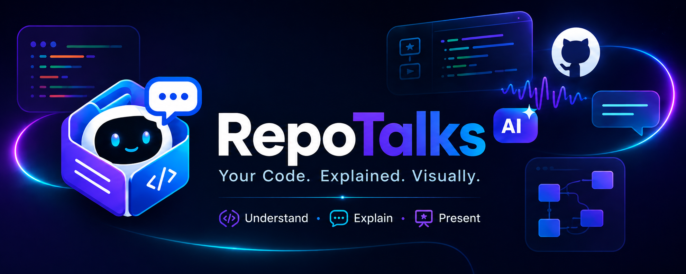

# 🤖 RepoTalks AI — Multimodal Codebase Learning & Viva Simulator
<p align="center">
  
</p>

[](https://repotalks.onrender.com)
[](https://aistudio.google.com/)
[](https://fastapi.tiangolo.com/)
[](https://nextjs.org/)
[](LICENSE)

> **RepoTalks AI** is an agentic, multimodal AI platform that turns any software repository into an interactive, conversational learning experience. Whether you're preparing for a **project viva defense**, conducting a **technical interview**, or onboarding onto a new codebase, RepoTalks AI breaks down code architecture, traces execution paths step-by-step, and evaluates your project knowledge in real-time.

🌐 **Try the Live Web App:** [https://repotalks.onrender.com](https://repotalks.onrender.com)

---

## 📌 Table of Contents
- [✨ Core Capabilities](#-core-capabilities)
- [🧩 Architecture & System Design](#-architecture--system-design)
- [🛠️ Tech Stack](#️-tech-stack)
- [🚀 Quick Start (Local Development)](#-quick-start-local-development)
- [🐳 Run with Docker](#-run-with-docker)
- [📄 License](#-license)

---

## ✨ Core Capabilities

### ⚡ 1. Repository RAG Ingestion & AST Parsing
* **Multiple Inputs**: Ingest code directly from public **GitHub repository URLs** or local **ZIP file archives**.
* **Source Parsing**: Python AST extraction plus lightweight JavaScript/TypeScript and Java symbol detection. Other supported source files are indexed as text.
* **Local Persistent Vector Store**: Embedded SQLite storage using Google's `gemini-embedding-2` model for Retrieval-Augmented Generation (RAG).
* **Interactive File Tree Explorer**: Visual file hierarchy browser with instant file symbol inspection.

### 🎙️ 2. Spoken Viva & Mock Interview Simulator
* **Interactive AI Examiner**: The AI speaks project viva questions aloud using browser-native **Text-to-Speech (TTS)**.
* **Hands-Free Speech Input**: Answer viva questions naturally via **Speech-to-Text (STT)** accompanied by an animated audio soundwave visualizer.
* **Real-Time Grading & Feedback**: Receive instant scores out of 10, key strengths, detailed critiques, and model answers.
* **Comprehensive Session Report**: Generates an end-of-viva report card highlighting mastery areas and preparation recommendations.

### 🗺️ 3. Auto-Generated Interactive Architecture Maps
* **Live Mermaid.js Diagrams**: Automatically generates System Component Trees, API Request Flow Maps, and Database ERDs.
* **Click-to-Explain Node Drawer**: Click on any node in the architecture diagram to reveal an instant AI breakdown of node responsibilities, source code pointers, and dependencies.

### 🗣️ 4. "Explain to Anyone" Multi-Audience Mode
Tailor codebase explanations to four distinct audiences with custom AI personas:
* 👔 **Tech Recruiter**: Highlights tech stack keywords, business impact, scalability, and delivery efficiency.
* 📊 **Non-Technical Manager**: Uses real-world analogies, high-level user workflows, and business ROI.
* 💻 **Fellow Developer**: Focuses on data models, design patterns, API contracts, state management, and edge cases.
* 🎓 **College Professor**: Analyzes algorithmic complexity ($O(n)$), data structure trade-offs, and theoretical foundations.

### 🔍 5. Agentic Code Tracer & Call-Chain Tour
* **Execution-Flow Assistant**: Produces an LLM-assisted, code-context-grounded walkthrough for user queries (e.g., *"Trace the user authentication flow"*). It is not a runtime debugger or a verified call-graph engine.
* **Guided Hop Tour**: Highlights specific file paths, line ranges, function signatures, and provides live streaming narration for every hop.

### 📊 6. Project Health & Refactoring Scorecard
* **Quantitative Health Metrics**:
  * 🟢 **Readability Score** (0–100)
  * 🔵 **Documentation Coverage %** (0–100)
  * 🟡 **Cyclomatic Complexity Rating** (0–100)
  * 🔴 **Security Vulnerability Assessment** (0–100)
  * 🎓 **Interview Readiness Score** (0–100)
* **Code Optimization Snippets**: Side-by-side comparison of **Current Code** vs **Refactored AI Recommendations**.

---

## 🧩 Architecture & System Design

```
                     ┌──────────────────────────────────────────┐
                     │          User Interface (Next.js)         │
                     │  - Glassmorphic UI & Speech (STT/TTS)   │
                     │  - Interactive Mermaid Architecture Maps  │
                     └────────────────────┬─────────────────────┘
                                          │  HTTP / Server-Sent Events (SSE)
                                          ▼
                     ┌──────────────────────────────────────────┐
                     │           FastAPI Python Backend         │
                     │  - AST Code Parser & File Tree Builder   │
                     │  - RAG Retrieval Engine                  │
                     └─────────────┬────────────────┬───────────┘
                                   │                │
            Vector Embeddings      │                │  Prompt & Stream Processing
            (gemini-embedding-2)   ▼                ▼
                     ┌────────────────────┐   ┌───────────────────────────────┐
                     │ SQLite Vector Store│   │     Google Gemini AI API      │
                     │ (Local RAG Search) │   │ - gemini-3.6-flash (Fast SSE) │
                     └────────────────────┘   │ - gemini-3.6-flash (Deep RAG) │
                                              └───────────────────────────────┘
```

---

## 🛠️ Tech Stack

| Layer | Technology | Purpose |
| :--- | :--- | :--- |
| **AI Models** | **Google Gemini 3.6 Flash** | Architecture generation, quantitative code auditing & deep analysis |
| | **Google Gemini 3.6 Flash** | Real-time SSE streaming chat, Viva examiner, and Code Tracer |
| | **gemini-embedding-2** | Code chunk vector embeddings for RAG retrieval |
| **Backend** | **Python 3.11 / FastAPI** | High-performance async REST API & Server-Sent Events (SSE) |
| **Vector Store** | **SQLite + NumPy** | Embedded, lightweight persistent vector database |
| **Frontend** | **Next.js 14 (App Router)** | Modern React 18 interface with static export deployment |
| **Styling & UI** | **Tailwind CSS + Framer Motion** | Frosted glassmorphic design, fluid micro-animations |
| **Visualizations** | **Mermaid.js** | Interactive diagram generation (Component, API Flow, ERD) |
| **Deployment** | **Render / Docker** | Single unified Web Service deployment container |

---

## 🚀 Quick Start (Local Development)

### Prerequisites
* **Python 3.10+**
* **Node.js 18+**
* **Google Gemini API Key** ([Get your free key here](https://aistudio.google.com/app/apikey))

### 1. Clone Repository
```bash
git clone https://github.com/aniXsamurai/RepoTalks.git
cd RepoTalks
```

### 2. Set Up & Run Backend
```bash
python3 -m venv venv
source venv/bin/activate
pip install -r backend/requirements.txt
uvicorn backend.main:app --host 0.0.0.0 --port 8080 --reload --reload-dir backend
```

### 3. Set Up & Run Frontend (In a separate terminal)
```bash
cd frontend
npm install
npm run dev
```

Open your browser to `http://localhost:3000`. Navigate to **Settings** to input your Gemini API Key.

---

## 🐳 Run with Docker

RepoTalks AI includes a multi-stage `Dockerfile` that packages both the Next.js static frontend and FastAPI backend into a single container:

```bash
# Build the Docker image
docker build -t repotalks .

# Run the container
docker run -p 8080:8080 -e GEMINI_API_KEY="your_api_key_here" repotalks
```

Access the application at `http://localhost:8080`.

---

## 🚀 Production Deployment

RepoTalks AI can be deployed on the **100% Free Tier** using **Vercel** (for the Next.js frontend) and **Render** (for the FastAPI backend), or as a single unified service.

See the complete, step-by-step guide in [DEPLOY.md](file:///d:/RepoTalk/DEPLOY.md).

---

## 📄 License

Distributed under the **MIT License**. See `LICENSE` for more information.

---

<p align="center">
  Made with ❤️ by <a href="https://github.com/aniXsamurai">aniXsamurai</a> & <a href="https://github.com/ravi3404">ravi3404</a>— Powered by Google Gemini AI
</p>
